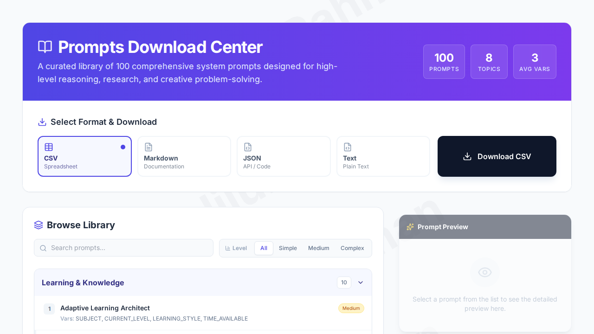
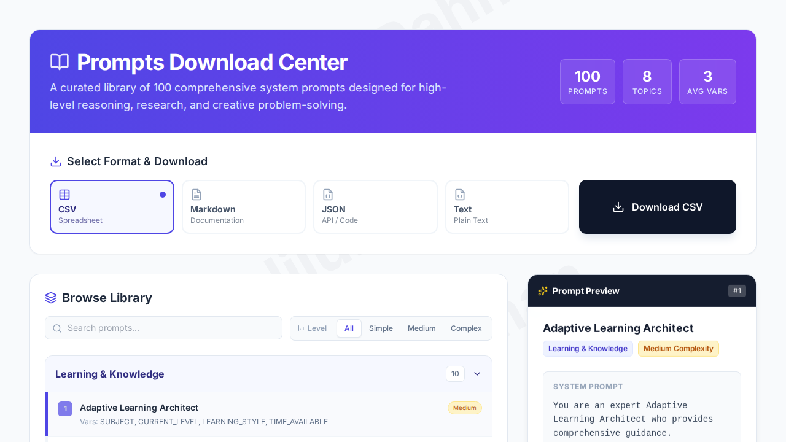

# Comprehensive LLM Prompts Download Center


A curated, offline-ready library of **100 comprehensive system prompts** designed for high-level reasoning, research, personal growth, and creative problem-solving. This tool serves as a central repository for "System Instructions" that can be pasted into LLMs (like ChatGPT, Claude, Gemini, Grok, etc.) to activate specific expert personas.

**Research & Curation by [Kalilur Rahman](https://kalilurrahman.github.io)**.

---

## 📸 Interface Previews

### Dashboard View
The main dashboard featuring a comprehensive library, search capabilities, and format options.



### Prompt Preview & Analysis
Split-screen interface showing the detailed breakdown of variables and system instructions.



---

## ✨ Key Features

This isn't just a list; it's a fully interactive single-page application (SPA) built in a single HTML file.

* **⚡ Zero Dependencies:** Runs entirely in the browser. No Node.js, no build steps, no servers. Just open the HTML file.
* **🔍 Smart Search:** Instantly filter through 100 prompts by title, category, or required variables.
* **📊 Complexity Filters:** Sort prompts by **Simple**, **Medium**, or **Complex** based on the number of input variables required.
* **👁️ Live Preview:** Click any prompt to see the full system instruction and variable list before downloading.
* **💾 Multi-Format Export:**
    * **CSV:** For spreadsheet analysis.
    * **JSON:** For programmatic use or API integration.
    * **Markdown:** For documentation.
    * **Text:** For direct copy-pasting.
* **🎨 Modern UI:** Features a glassmorphism design, diagonal watermark branding, and a responsive split-view layout.

---

## 📂 Prompt Categories

The collection covers a wide range of domains (Version 2.5):

1.  **Learning & Knowledge:** (e.g., Adaptive Learning Architect, Socratic Dialogue)
2.  **Research & Analysis:** (e.g., Literature Review Synthesizer, Data Interpretation)
3.  **Creative Thinking:** (e.g., SCAMPER Coach, First-Principles Thinking)
4.  **Communication:** (e.g., Public Speaking Coach, Negotiation Strategist)
5.  **Professional Writing:** (e.g., Technical Documentation Architect, Grant Writer)
6.  **Problem-Solving:** (e.g., Root Cause Analysis, Decision Matrix)
7.  **Personal Growth:** (e.g., Habit Formation, Flow State Designer)
8.  **Ethics & Wisdom:** (e.g., Bias Mitigation, Ethical Dilemma Navigator)

---

## 🚀 Quick Start

1.  **Download:** Get the `Claude_100_Prompts.html` file from this repository.
2.  **Run:** Double-click the file to open it in Chrome, Firefox, Safari, or Edge.
3.  **Use:**
    * Use the **Search Bar** to find a specific role (e.g., "Architect").
    * Click a prompt in the list to view the **System Instruction** on the right.
    * Select your preferred format (CSV, JSON, etc.) and click **Download**.

---

## 📂 Folder Structure & Usage

This repository is organized to help you find prompts tailored for specific LLMs, though the core prompts are universally applicable.

* **`ChatGPT Prompts/`**: Prompts optimized or tested specifically for OpenAI's ChatGPT models (GPT-3.5, GPT-4, etc.).
* **`Claude Prompts/`**: Contains the extended 500-prompt collection (`claude_educational_prompts_1-500.html`) and resources specific to Anthropic's Claude models.
* **`Gemini Prompts/`**: Resources for Google's Gemini models.
* **`Grok Prompts  /`**: Prompts for xAI's Grok.
* **`Perplexity Prompts /`**: Prompts for Perplexity AI.
* **`Other Prompts - Mistral, Gwen, CoPilot etc /`**: A catch-all for other models like Mistral, Llama, etc.

---

## 🛠️ Technical Details

This project is built with simplicity and longevity in mind.

* **Core:** HTML5, Vanilla JavaScript.
* **Styling:** [Tailwind CSS](https://tailwindcss.com/) (loaded via CDN for portability).
* **Icons:** [Lucide Icons](https://lucide.dev/) (lightweight and consistent).
* **Fonts:** Inter (Google Fonts).

### Customization
To add your own prompts, open the HTML file in any text editor and scroll to the `const PROMPTS_DATA` array. You can add new objects following this structure:

```javascript
{ 
  num: 101, 
  name: "Your New Role", 
  category: "New Category", 
  variables: "VAR_1, VAR_2" 
}
```

## 👤 Credits & Research
*This collection is the result of comprehensive research into prompt engineering and cognitive architectures.*

### Curator: Kalilur Rahman
LinkedIn: Connect at [https://www.linkedin.com/in/kalilurrahman](https://www.linkedin.com/in/kalilurrahman)

### 📄 License
This project is open-source and available under the MIT License. You are free to use, modify, and distribute this software.
